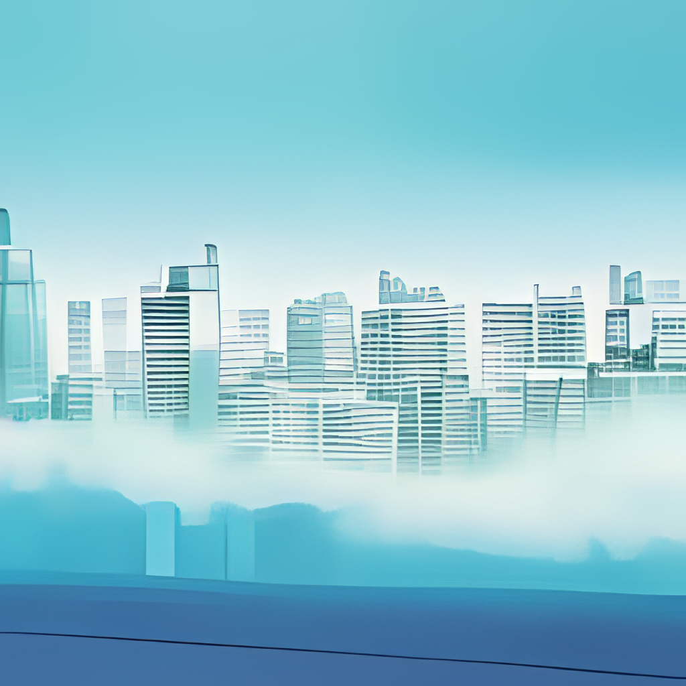
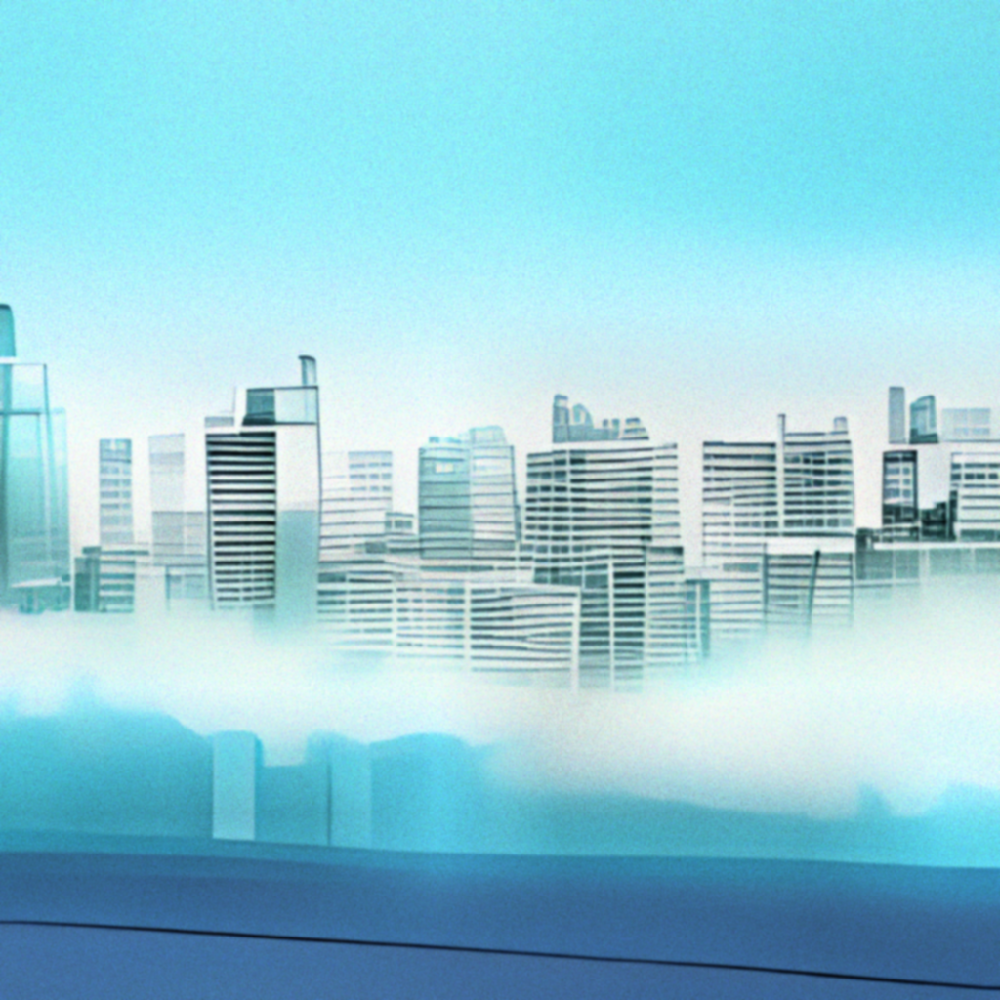

# Local ruDalle
The purpose of this repository is to offer an easy way to use ruDalle directly from an IDE such as pyCharm, cuz constantly running a process with a buncha arguments in the command line sux.

# Model Training
## How To Train A Model
1. Download the repository (if you haven't already!)
2. Put a checkpoint you want to continue from in the checkpoints folder (optional)
3. Put images in content/Data/name-of-your-model
4. Update config.yaml with the name of your model, caption that describes your dataset, and how many epochs you want to train for
5. run main.py

for extra fine control over training, you can put a data_desc.csv file in the data folders to overwrite or append captions to individual images.

### Training Config
| Parameter | How to use |
| ----------|------------|
| `train_model` | name of model in checkpoints folder (omit the .pt) |
| `train_prompt` | prompt for image generation. leave blank to use the default prompt from the original ruDalle colab notebook. Once you start training a model with a particular prompt, probably don't start using a different one unless you know what you're doing. |
| `translate` | auto-translate prompt from English to Russian (if this is enabled, it won't try to translate the default prompt so don't worry about that.) |
| `resume` | If `True`, resumes training from an existing checkpoint. If `False`, creates a new checkpoint or, if one with the provided `train_model` name exists, overwrites it. Be real careful about not leaving this `True` after the initial training session! |
| `universe` | holdover from the looking glass colab notebook, if you don't know what learning rate you want, select how similar you want the images generated to be to the prompt images. Options are `Low`, `Medium`, `High`, and `Custom` |
| `custom_lr` | Custom learning rate, used only if `universe = Custom`. For models with a large dataset, I like to set this to 1.0e-6 or 1.0e-7. |
| `epochs` | How many times to loop over all the data. When training a model with a huge dataset and a very low learning rate, a little bit goes a long way here. On the other hand if you're training with just one or two images, probably 50-100 would do it. |
| `warmup_steps` | when starting a new model, there's a risk of the model latching onto the first few samples it trains on and focusing on them too much from then on. Warmup steps are training steps with a really low learning rate to prevent this sort of thing from happening. You probably just need like 50? |
| `log_epoch` | write to console what epoch it is at the start of a new epoch. Set 0 to not use. |
| `save_epoch` | save a checkpoint with number of steps so far in training in the filename every `save_epoch` steps. Set 0 to not use. |
| `preview_epoch` | generate an image with the prompt every `preview_epoch` epochs. Set 0 to not use. |
| `preview_steps` | generate an image with the prompt every `preview_steps` steps. Set 0 to not use. Handy if you have so many samples in your dataset even a single epoch takes forever to get through. |
| `preview_super_res` | upscale preview images if `True`; runs the risk of causing an out of memory error. |
| `data_desc` | Optional training data for advanced nerds only. If there are captions specified for a specific image in a data_desc.csv file in content/Data/your-model-name, what to do about the additional caption(s). Options are `add`, `append`, `override`, or leave blank to disregard. `add` adds a single sample per caption associated with an image. `append` appends all the captions to a single dataloader entry. `override` will cause the image in question to not use the `train_prompt` at all (in favor of the one provided in the file.) |
| `flip_chance` | value between 0 and 1, probability of images from dataset being flipped horizontally when loaded into the train dataloader. (Doesn't affect the image files on disk.) Maybe can help the model generalize better? |

# Image Generation
## How To generate images
1. Download the repository (if you haven't already!)
2. Have a model checkpoint in the checkpoints folder (optional)
3. Update config.yaml with the name of your model or leave blank to use Malevich XL; set text prompt, location of image prompts, number of images to generate, etc
4. run generate.py

### Generation Config
| Parameter | How to use |
| ----------|------------|
| `gen_model` | name of model in checkpoints folder (omit the .pt) |
| `gen_prompt` | prompt for image generation. leave blank to use the default prompt from the original ruDalle colab notebook. Prompts are automatically translated to Russian so don't worry about that. |
| `output_dir` | if left blank, output will be saved to content/output/your-models-name, use this to specify a subfolder of that directory to save stuff to |
| `file_name` | If blank, the filenames of the generated images will be prefixed with the prompt. Otherwise they will be prefixed with this. |
| `use_image_prompts` | if `True`, you must have images in content/Data/your-models-name/Prompt. These images will be used as prompts for image generation. If shuffle options below are enabled, image prompts will be randomized. |
| `prompt_flip` | value between 0 and 1, probability of prompt image being flipped horizontally before being fed into the model |
| `image_count` | how many images to generate. images are generated one at a time so you can put tons here without worrying about out of memory errors. |
| `shuffle_start` | if `True`, before generating images, all lists are randomized |
| `shuffle_loop` | if `True`, when generating more images than there are items in a list, shuffle the list every time it's been fully used. |
| `seed` | if `True`, manually seeds with the value specified below |
| `gen_seed` | User-provided seed for randomization. Used only if `seed` is `True` |
| `temperature` | this is a list of possible temperatures to use for generation. If none of the shuffle options are `True`, these will be used in the order provided. |
| `top_p` | this is a list of values for top p filtering. If no shuffle option is set to `True`, values will be used in order provided |
| `top_k` | this is a list of values for top p filtering. If no shuffle option is set to `True`, values will be used in order provided |
| `super_res` | if `True`, upscale output |
| `upscale` | how much to upscale output by. Options are `x2`, `x4`, and `x8`, but I've never been able to use `x8` without getting out of memory errors. |

## Post Effects! Wow!!
When generating images you can opt to apply a little bit of post processing to them automatically. (The purpose being to make your anime cities, which you are of course generating, look more like old screenshots.)  This next image is unaltered output from the model.



Same image with `noise=speckle`, `noise_strength=0.5`, `clip_limit=0.005`, `sigma_a=1`, `sigma_b=1`



### PostFX Config
| Parameter | How to use |
| ----------|------------|
| `post_fx`  | `True` to enable processing. If `False`, none of the other params matter. |
| `save_both` | `True` to save both the original and processed image. `False` to save only the processed image. |
| `noise` | noise type. Options are `gaussian`, `localvar`, `poisson`, `salt`, `pepper`, `s&p`, `speckle` (or blank to not use) |
| `noise_strength` | put value between 0 and 1. How visible the noise is on the image. |
| `clip_limit` | value between 0 and 1 for exposure adjustment (contrast). 0.005 is a good starting point. Bigger values = more contrasty |
| `sigma_a` | value of blur applied before other effects. Can be any float but you'll probably want between 0 and 2 |
| `sigma_b` | value of final blur applied after all other effects. Can be any float but you'll probably want between 0 and 2 |


## Xibanya's Pretrained models
these area all finetuned from Malevich XL and are thus compatible with any implementation of ruDalle. If you use these, put them in the checkpoints folder.

[Anime Cities Malevich](https://huggingface.co/Xibanya/City)


[Anime Sunset Malevich](https://huggingface.co/Xibanya/sunset_city)


The rest of this readme is from the original ru-dalle repo

# ruDALL-E
### Generate images from texts

[](https://www.apache.org/licenses/LICENSE-2.0)
[](https://pepy.tech/project/rudalle)
[](https://codecov.io/gh/sberbank-ai/ru-dalle)
[](https://gitlab.com/shonenkov/ru-dalle/-/pipelines)
[](https://results.pre-commit.ci/latest/github/sberbank-ai/ru-dalle/master)

```
pip install rudalle==1.1.0rc0
```
### 🤗 HF Models:
[ruDALL-E Malevich (XL)](https://huggingface.co/sberbank-ai/rudalle-Malevich) \
[ruDALL-E Emojich (XL)](https://huggingface.co/sberbank-ai/rudalle-Emojich) (readme [here](https://github.com/sberbank-ai/ru-dalle/blob/master/Emojich.md)) \
[ruDALL-E Surrealist (XL)](https://huggingface.co/shonenkov-AI/rudalle-xl-surrealist)


### Minimal Example:

[](https://colab.research.google.com/drive/1wGE-046et27oHvNlBNPH07qrEQNE04PQ?usp=sharing)
[](https://www.kaggle.com/shonenkov/rudalle-example-generation)
[](https://huggingface.co/spaces/anton-l/rudall-e)

**Example usage ruDALL-E Malevich (XL) with 3.5GB vRAM!**
[](https://colab.research.google.com/drive/1AoolDYePUpPkRCKIu0cP9zV7lX5QGD3Z?usp=sharing)

**Finetuning example**
[](https://colab.research.google.com/drive/1Tb7J4PvvegWOybPfUubl5O7m5I24CBg5?usp=sharing)

### generation by ruDALLE:
```python
import ruclip
from rudalle.pipelines import generate_images, show, super_resolution, cherry_pick_by_ruclip
from rudalle import get_rudalle_model, get_tokenizer, get_vae, get_realesrgan
from rudalle.utils import seed_everything

# prepare models:
device = 'cuda'
dalle = get_rudalle_model('Malevich', pretrained=True, fp16=True, device=device)
tokenizer = get_tokenizer()
vae = get_vae(dwt=True).to(device)

# pipeline utils:
realesrgan = get_realesrgan('x2', device=device)
clip, processor = ruclip.load('ruclip-vit-base-patch32-384', device=device)
clip_predictor = ruclip.Predictor(clip, processor, device, bs=8)
text = 'радуга на фоне ночного города'

seed_everything(42)
pil_images = []
scores = []
for top_k, top_p, images_num in [
    (2048, 0.995, 24),
]:
    _pil_images, _scores = generate_images(text, tokenizer, dalle, vae, top_k=top_k, images_num=images_num, bs=8, top_p=top_p)
    pil_images += _pil_images
    scores += _scores

show(pil_images, 6)
```

### auto cherry-pick by ruCLIP:
```python
top_images, clip_scores = cherry_pick_by_ruclip(pil_images, text, clip_predictor, count=6)
show(top_images, 3)
```

### super resolution:
```python
sr_images = super_resolution(top_images, realesrgan)
show(sr_images, 3)
```


```python
text, seed = 'красивая тян из аниме', 6955
```


### Image Prompt
see `jupyters/ruDALLE-image-prompts-A100.ipynb`
```python
text, seed = 'Храм Василия Блаженного', 42
skyes = [red_sky, sunny_sky, cloudy_sky, night_sky]
```


### VideoDALL-E | ru[CogVideo](https://github.com/THUDM/CogVideo) by [@cene555](https://github.com/cene555)
**Video generation example**
[](https://colab.research.google.com/drive/1A_3Oe9r9DP3Ayd6DPvqKHIKlwNfLhVP5?usp=sharing)
**Finetuning example**
[](https://colab.research.google.com/drive/1R_joYWlvToA24tsa9BFYa2D6ffiMtyVy?usp=sharing)


### Aspect ratio images [**-->NEW<--**](https://github.com/shonenkov-AI/rudalle-aspect-ratio)


### 🚀 Contributors 🚀

- [@bes](https://github.com/bes-dev) shared [great idea and realization with IDWT](https://github.com/bes-dev/vqvae_dwt_distiller.pytorch) for decoding images with higher quality 512x512! 😈💪 thanks a lot for your constructive advices, appreciate it
- [@neverix](https://www.kaggle.com/neverix) thanks a lot for contributing for speed up of inference
- [@Igor Pavlov](https://github.com/boomb0om) trained model and prepared code with [super-resolution](https://github.com/boomb0om/Real-ESRGAN-colab)
- [@oriBetelgeuse](https://github.com/oriBetelgeuse) thanks a lot for easy API of generation using image prompt
- [@Alex Wortega](https://github.com/AlexWortega) created first FREE version colab notebook with fine-tuning [ruDALL-E Malevich (XL)](https://huggingface.co/sberbank-ai/rudalle-Malevich) on sneakers domain 💪
- [@Anton Lozhkov](https://github.com/anton-l) Integrated to [Huggingface Spaces](https://huggingface.co/spaces) with [Gradio](https://github.com/gradio-app/gradio), see [here](https://huggingface.co/spaces/anton-l/rudall-e)

### Supported by

[](https://airi.net)


### Social Media

[](https://habr.com/ru/company/sberbank/blog/589673/)
[](https://habr.com/ru/company/sberdevices/blog/586926/)
